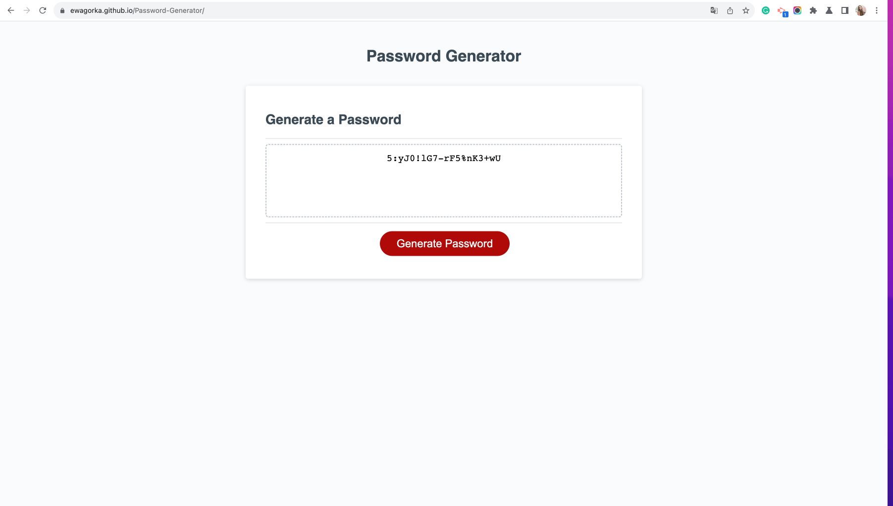

# Password-Generator
Week 5 challenge of the Front-End Development Bootcamp

## Project Description
For the fourth week's challenge we were asked to write a password generator app. 

We were given a starter code that consisted of a html, css and javascript file. The provided index.html file was fully styled and responsive and the javascript file had some preexisiting data and functions, that we were asked to work with. 

Our task was to finish three existing functions (getPasswordOptions(), getRandom(arr), generatePassword()), to make the app fully functional.

The requirements that we were given were:
" The application application must:

* Generate a password when the button is clicked.
* Present a series of prompts for password criteria:
  * Length of password:
  * At least 8 characters but no more than 128.:
  * Character types:
  * Lowercase 
  * Uppercase 
  * Numeric 
  * Special characters ($@%&*, etc.)
* Code should validate for each input and at least one character type should be selected.
* Once all prompts are answered, the password should be generated and displayed in an alert or written to the page
* Given the user choices, a password should appear in the box above the button."

## My Approach
I started off by reading the instructions and studying the provided code.

After that I've put a lot of console.log commands within the code to better understand how it works and how I can use the functions within each other. After that read the criteria again and started working on the first function - getPasswordOptions().

Knowing that user will have to specify more than one condition for the desired password I decided that it will be best to make this function return an object that will hold user choices within it's attributes. I also considered using an array to keep the user's choices, but I chose to go with the object so I can give better suited names for each attribute. I used a prompt to ask the user for their preffered password lenght and put 

## Technologies
This project was made using HTML,CSS and Javascript.

## Deployed Website
The deployed website: https://ewagorka.github.io/Password-Generator/

## Deployed Website Screenshot

## License
Please refer to the LICENSE in the repo.