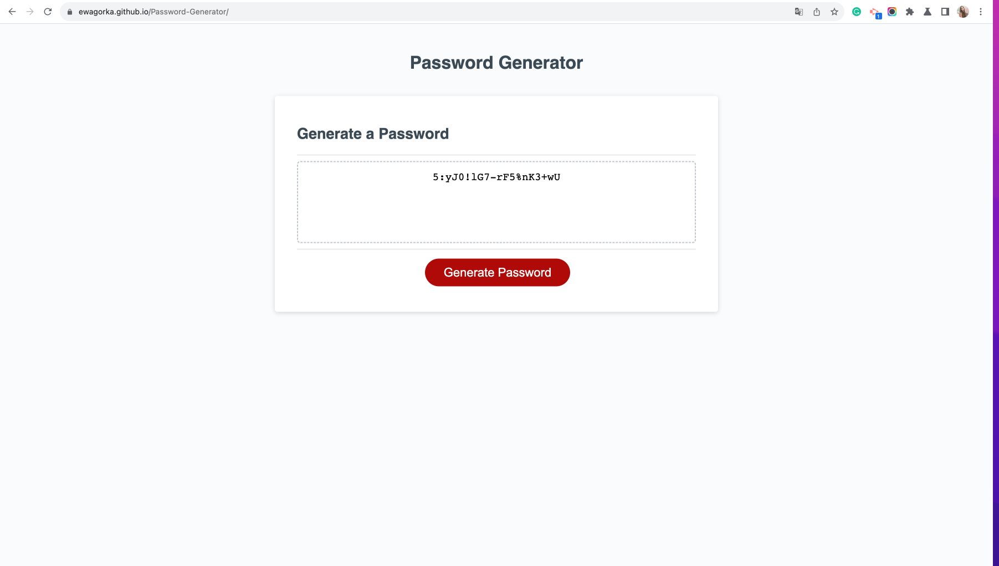

# Password-Generator
Week 5 challenge of the Front-End Development Bootcamp

## Project Description
For the fourth week's challenge we were asked to write a password generator app. 

We were given a starter code that consisted of a html, css and javascript file. The provided index.html file was fully styled and responsive and the javascript file had some preexisiting data and functions, that we were asked to work with. 

Our task was to finish three existing functions (getPasswordOptions(), getRandom(arr), generatePassword()), to make the app fully functional.

The requirements that we were given were:
" The application application must:

* Generate a password when the button is clicked.
* Present a series of prompts for password criteria:
  * Length of password:
  * At least 8 characters but no more than 128.:
  * Character types:
  * Lowercase 
  * Uppercase 
  * Numeric 
  * Special characters ($@%&*, etc.)
* Code should validate for each input and at least one character type should be selected.
* Once all prompts are answered, the password should be generated and displayed in an alert or written to the page
* Given the user choices, a password should appear in the box above the button."

## My Approach
I started this challenge as usual by reading the instructions and studying the provided code.

After studying the code, I went ahead and put a bunch of console.log commands in the Javascript file to help me understand how the functions work. Then after I got some basic understanding and ideas on how to solve this challenge, I read the criteria again and split the work into smaller pieces that I could handle.

It was pretty simple to divide the work - I just made each function a separate task. For every task, I did the same thing:
* created a new branch
* figured out what the function needed to do and what they should return (I used comments to explain each step within each function)
* initialised any necessary variables
* made sure the function checked the user's input correctly
* tested the function to make sure it worked.

As mentioned above, the explanation of how each function works can be found in the comments in the Javascript file.

Below I'll list the key outcomes I got from working on each function:
1. getPasswordOptions()
* I learned how useful objects can be to hold multiple values of multiple types, that belong to one category (I used an object to store all user password preferences)
* I learned how to use .some method on objects to check if some of its attributes check given criteria
2. getRandom(arr)
* I practised the Math.floor() and Math.random() methods to generate a random number from a given range of numbers
3. generatePassword()
* I learned how to use functions within functions, to get all the necessary data
* I practised using while loops (and breaking from them at certain points) and if statements
* I learned how to turn an array into a single string by using the .join method

In comparison to the previous challenges, this one proved to be considerably more challenging. However, it was also a lot of fun to work on, and it was very rewarding to see it work in the end. 

## Technologies
This project was made using HTML,CSS and Javascript.

## Deployed Website
The deployed website: https://ewagorka.github.io/Password-Generator/

## Deployed Website Screenshot

## License
Please refer to the LICENSE in the repo.